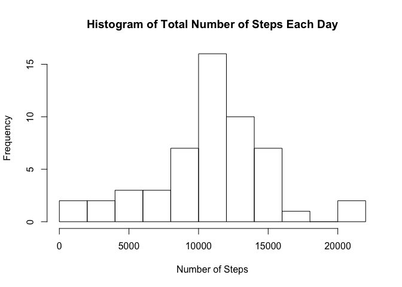
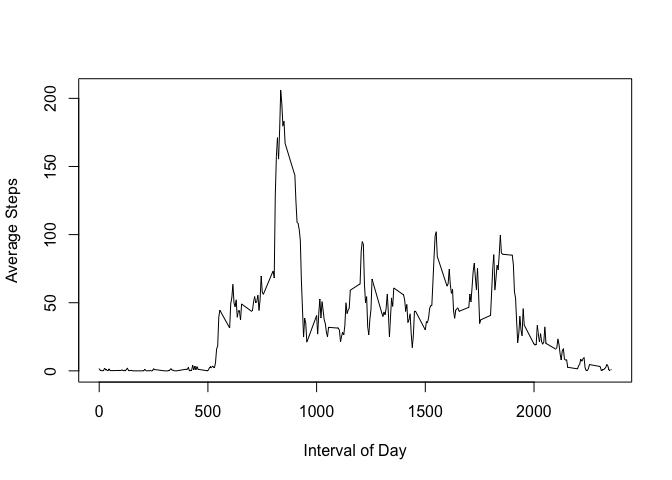
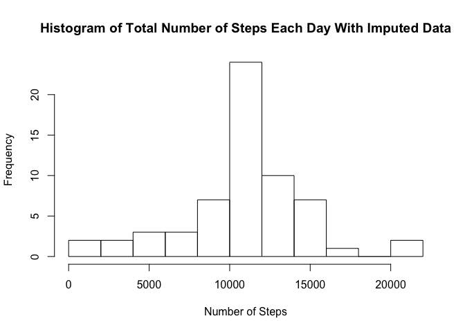
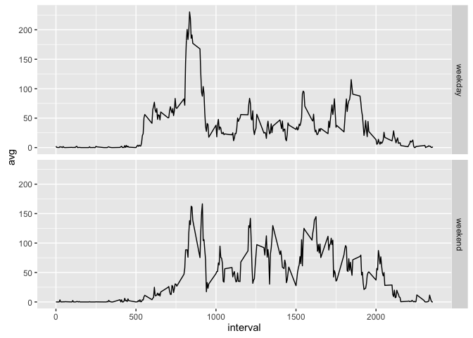

# Reproducible Research: Peer Assessment 1


## Loading and preprocessing the data

The data for this research was obtained from forking the repository: <https://github.com/rdpeng/RepData_PeerAssessment1>.


```r
setwd("~/coursera/RepData_PeerAssessment1")
dataDir<-"data"
zipFile<-"activity.zip"
dataSource<-paste(dataDir,"/","activity.csv",sep="")
if(!dir.exists(dataDir)) { dir.create(dataDir)  }

# unzip file
unzip(zipFile,exdir=dataDir)
dt<-read.csv(dataSource)
```

## What is mean total number of steps taken per day?

1. Total number of steps taken per day.


```r
dtNoNa<-dt[complete.cases(dt[,1]),]
stepsPerDay<-aggregate(dtNoNa$steps,by=list(Day=dtNoNa$date),sum)
stepsPerDay
```

```
##           Day     x
## 1  2012-10-02   126
## 2  2012-10-03 11352
## 3  2012-10-04 12116
## 4  2012-10-05 13294
## 5  2012-10-06 15420
## 6  2012-10-07 11015
## 7  2012-10-09 12811
## 8  2012-10-10  9900
## 9  2012-10-11 10304
## 10 2012-10-12 17382
## 11 2012-10-13 12426
## 12 2012-10-14 15098
## 13 2012-10-15 10139
## 14 2012-10-16 15084
## 15 2012-10-17 13452
## 16 2012-10-18 10056
## 17 2012-10-19 11829
## 18 2012-10-20 10395
## 19 2012-10-21  8821
## 20 2012-10-22 13460
## 21 2012-10-23  8918
## 22 2012-10-24  8355
## 23 2012-10-25  2492
## 24 2012-10-26  6778
## 25 2012-10-27 10119
## 26 2012-10-28 11458
## 27 2012-10-29  5018
## 28 2012-10-30  9819
## 29 2012-10-31 15414
## 30 2012-11-02 10600
## 31 2012-11-03 10571
## 32 2012-11-05 10439
## 33 2012-11-06  8334
## 34 2012-11-07 12883
## 35 2012-11-08  3219
## 36 2012-11-11 12608
## 37 2012-11-12 10765
## 38 2012-11-13  7336
## 39 2012-11-15    41
## 40 2012-11-16  5441
## 41 2012-11-17 14339
## 42 2012-11-18 15110
## 43 2012-11-19  8841
## 44 2012-11-20  4472
## 45 2012-11-21 12787
## 46 2012-11-22 20427
## 47 2012-11-23 21194
## 48 2012-11-24 14478
## 49 2012-11-25 11834
## 50 2012-11-26 11162
## 51 2012-11-27 13646
## 52 2012-11-28 10183
## 53 2012-11-29  7047
```

2. Histogram of Total Number of Steps Each Day


```r
hist(stepsPerDay$x,breaks=10,xlab="Number of Steps",main="Histogram of Total Number of Steps Each Day")
```

\

3. Calculate and report the mean and median of the total number of steps taken per day


```r
message("mean total steps per day: ")
```

```
## mean total steps per day:
```

```r
mean(stepsPerDay$x)
```

```
## [1] 10766.19
```

```r
message("median total steps per day: ")
```

```
## median total steps per day:
```

```r
median(stepsPerDay$x)
```

```
## [1] 10765
```

## What is the average daily activity pattern?

1. Make a time series plot (i.e. type = "l") of the 5-minute interval (x-axis) and 
   the average number of steps taken, averaged across all days (y-axis)


```r
library(dplyr)
```

```
## 
## Attaching package: 'dplyr'
```

```
## The following objects are masked from 'package:stats':
## 
##     filter, lag
```

```
## The following objects are masked from 'package:base':
## 
##     intersect, setdiff, setequal, union
```

```r
avgStepsByInt<-dtNoNa %>% group_by(interval) %>% summarize(avg=mean(steps))
plot(avgStepsByInt$interval,avgStepsByInt$avg,type="l",ylab="Average Steps",xlab="Interval of Day")
```

\

2. Which 5-minute interval, on average across all the days in the dataset, 
   contains the maximum number of steps?


```r
avgStepsByInt[avgStepsByInt$avg == max(avgStepsByInt$avg),]
```

```
## Source: local data frame [1 x 2]
## 
##   interval      avg
##      (int)    (dbl)
## 1      835 206.1698
```

## Imputing missing values

1. Calculate and report the total number of missing values in the 
   dataset (i.e. the total number of rows with NAs)
   

```r
naRows<-nrow(dt)-nrow(dtNoNa)
naRows
```

```
## [1] 2304
```

2. Devise a strategy for filling in all of the missing values in the dataset. 
   The strategy does not need to be sophisticated. For example, you could use 
   the mean/median for that day, or the mean for that 5-minute interval, etc.

Strategy: Use the Mean of the interval to fill the data, but round values.

3. Create a new dataset that is equal to the original dataset but with the 
   missing data filled in.
   

```r
# isolate the rows with NA values in the steps
dtNASteps<-dt[which(is.na(dt$steps)),]
# combine the data to get the average for the interval
avgStepsByInt$rndAvg<-round(avgStepsByInt$avg)
dtMerge<-merge(dtNASteps,avgStepsByInt,by=c("interval"))
# get only the fields desired
dtMrg<-dtMerge[,c("rndAvg","date","interval")]
# change the column names
names(dtMrg)<-c("steps","date","interval")
# combine the data with NA excluded with the imputed data
dtImputed<-rbind(dtMrg,dtNoNa)
# order the data frame by date and the interval 
dtImp<-dtImputed[with(dtImputed,order(date,interval)),]
```

4. Make a histogram of the total number of steps taken each day and Calculate 
   and report the mean and median total number of steps taken per day. Do these 
   values differ from the estimates from the first part of the assignment? What 
   is the impact of imputing missing data on the estimates of the total daily 
   number of steps?


```r
stepsPerDay2<-aggregate(dtImp$steps,by=list(Day=dtImp$date),sum)
hist(stepsPerDay2$x,breaks=10,xlab="Number of Steps",main="Histogram of Total Number of Steps Each Day With Imputed Data")
```

\

```r
message("mean total steps per day: ")
```

```
## mean total steps per day:
```

```r
mean(stepsPerDay2$x)
```

```
## [1] 10765.64
```

```r
message("median total steps per day: ")
```

```
## median total steps per day:
```

```r
median(stepsPerDay2$x)
```

```
## [1] 10762
```

In this particular case, there was no significant impact of imputing the missing data.
There was an increase of frequency but the general shape of the histogram remained the same.
The mean and the median stayed pretty close 10766 vs. 10765 and 10765 vs. 10762 respectively.


## Are there differences in activity patterns between weekdays and weekends?

1. Create a new factor variable in the dataset with two levels – “weekday” 
   and “weekend” indicating whether a given date is a weekday or weekend day.


```r
#install.packages("lubridate")
library(lubridate)
dtImp$dow<-wday(dtImp$date, label = TRUE)

dtImp$wend<-"weekday"
dtImp[dtImp$dow == "Sun","wend"]<-"weekend" 
dtImp[dtImp$dow == "Sat","wend"]<-"weekend"
dtImp$wend<-as.factor(dtImp$wend)
```

2. Make a panel plot containing a time series plot (i.e. type = "l") of the 
   5-minute interval (x-axis) and the average number of steps taken, averaged 
   across all weekday days or weekend days (y-axis). See the README file in 
   the GitHub repository to see an example of what this plot should look like 
   using simulated data.
   

```r
library(ggplot2)
avgStepsByWeInt<-dtImp %>% group_by(interval,wend) %>% summarize(avg=mean(steps))

g<-ggplot(avgStepsByWeInt,aes(x=interval,y=avg)) + geom_line() + facet_grid(wend ~ .)
print(g)
```

\
